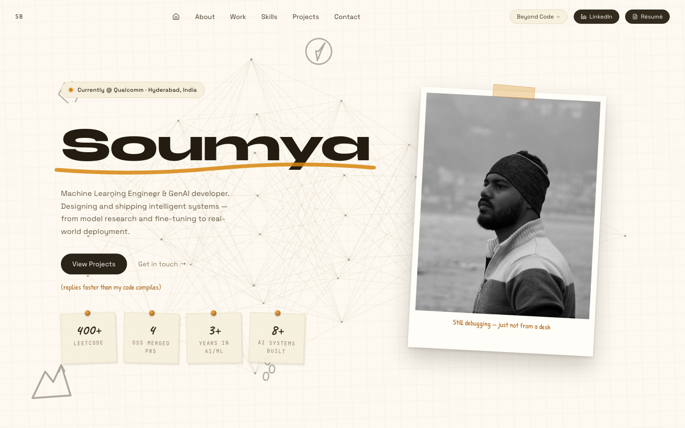
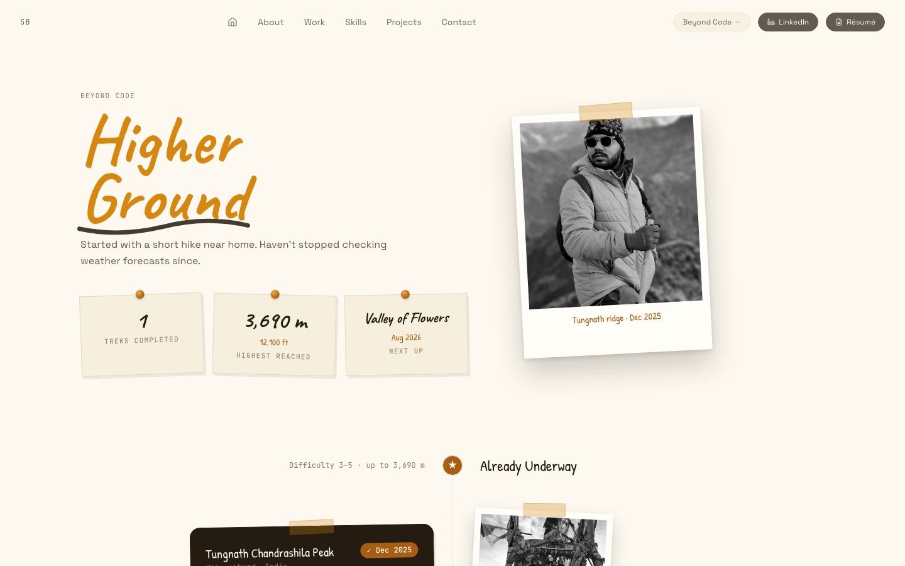

<div align="center">

# Soumya — Portfolio

**ML Engineer @ Qualcomm** — designing and shipping intelligent systems, one deploy at a time.

[](https://imsoumya.netlify.app)

[](https://react.dev)
[](https://vitejs.dev)
[](https://tailwindcss.com)
[](https://www.framer.com/motion/)
[](https://threejs.org)
[](https://gsap.com)
[](https://reactrouter.com)

</div>

<br/>




<br/>

## Contents

- [Features](#features)
- [Stack](#stack)
- [Getting started](#getting-started)
- [Editing content](#editing-content)
- [Project structure](#project-structure)
- [Deployment](#deployment)

## Features

- **Content-driven** — every section (name, work history, skills, projects,
  achievements, contact links, trek log) is data, not markup. Edit one JSON
  file, the whole site updates.
- **A notebook, not a template** — a tilted dot-grid background, hand-drawn
  doodles, and torn-paper seams between sections run through the whole site,
  not just the `/treks` hobby page (which goes further still: pinned trek
  photos hanging off the timeline, washi tape, hand-drawn circles).
- **A hand-drawn ink circle that isn't fake** — the emphasis marks around key
  numbers are generated at runtime from the actual rendered text size, so
  short and long values each get a naturally-proportioned, slightly-different
  loop instead of one shape stretched to fit.
- **3D animated hero** — a lightweight neural-network canvas built directly
  on `three.js` / `@react-three/fiber`, no heavy asset pipeline.
- **Smooth scrolling + scroll-triggered reveals** via Lenis + GSAP
  ScrollTrigger, layered with Framer Motion for component-level animation.
- **Client-side routing that actually works on refresh** — `/treks` is a
  real route, with a Netlify `_redirects` rule so deep links don't 404.

## Stack

| | |
|---|---|
| **Framework** | React 18 + Vite 6 |
| **Routing** | React Router |
| **Styling** | Tailwind CSS |
| **Animation** | Framer Motion, GSAP + ScrollTrigger, Lenis |
| **3D** | Three.js via `@react-three/fiber` |
| **Icons** | Lucide |

## Getting started

```bash
npm install
npm run dev
```

Opens at `http://localhost:5173` (Vite picks the next free port if that one's
taken). To make it reachable from another device on the same network (e.g. to
check on your phone):

```bash
npm run dev -- --host
```

Other scripts:

```bash
npm run build     # production build to dist/
npm run preview   # serve the production build locally
```

## Editing content

Almost everything on the site — name, tagline, work history, skills, projects,
achievements, contact links, and all trek data — lives in one place:

```
src/data/profile.json
```

Edit that file and the site updates; no need to touch component code for
content changes. Images live in `src/assets/images/` and are referenced from
there. Trek photos are the one exception worth knowing: drop a file into
`src/assets/images/treks/` and set `"photo": "filename"` (no extension) on
that trek's entry in `profile.json` — it's picked up automatically via
`import.meta.glob`, no component code to touch.

## Project structure

```
src/
  components/   Home page sections (Hero, About, Experience, Skills, ...)
  pages/        Route-level pages (TreksPage for /treks)
  data/         profile.json — single source of truth for content
  assets/       Images
public/         Static files copied as-is (favicons, _redirects)
```

## Deployment

Deployed on Netlify at **[imsoumya.netlify.app](https://imsoumya.netlify.app)**:

- **Build command**: `npm run build`
- **Publish directory**: `dist`
- `public/_redirects` handles the SPA fallback so deep links like `/treks`
  don't 404 on refresh or direct visit.

<br/>

<div align="center">

[](https://linkedin.com/in/imsoumya18)
[](https://github.com/imsoumya18)

</div>
