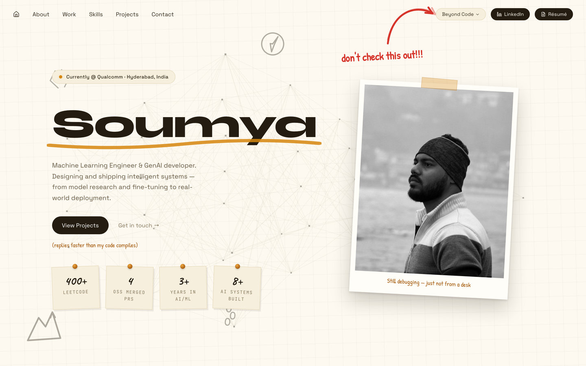
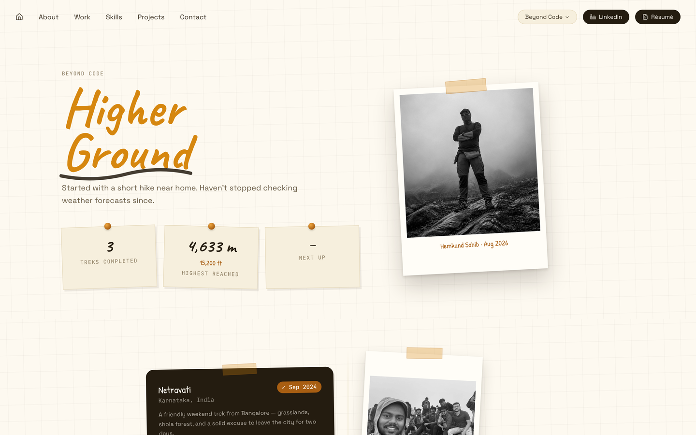

<div align="center">

# Soumya — Portfolio

**ML Engineer @ Qualcomm** — designing and shipping intelligent systems, one deploy at a time.

[](https://imsoumya.netlify.app)

[](https://react.dev)
[](https://vitejs.dev)
[](https://tailwindcss.com)
[](https://www.framer.com/motion/)
[](https://threejs.org)
[](https://gsap.com)
[](https://reactrouter.com)
[](https://docs.netlify.com/functions/overview/)

</div>

<br/>




<br/>

## Contents

- [Features](#features)
- [Stack](#stack)
- [Getting started](#getting-started)
- [Editing content](#editing-content)
- [Content admin panel](#content-admin-panel)
- [Project structure](#project-structure)
- [Deployment](#deployment)

## Features

- **Content-driven** — every section (name, work history, skills, projects,
  achievements, contact links, and all four "Beyond Code" hobby logs) is
  data, not markup. Edit one JSON file, the whole site updates.
- **Password-protected admin panel** — `/admin` is a schema-driven CMS for
  every section of the site, backed by Netlify Functions + Netlify Blobs.
  Add a trek, log a movie, or swap a poster from a phone, live, with no code
  push or rebuild. See [Content admin panel](#content-admin-panel).
- **"Beyond Code"** — four hobby pages off the main nav dropdown: `/treks`
  (a real timeline plus a wishlist), `/clicking` (an Instagram-embed photo
  wall), `/reading`, and `/watching` (a horizontally-scrolling filmstrip
  reel grouped by type, with a "Now Watching" spotlight card).
- **A notebook, not a template** — a tilted dot-grid background, hand-drawn
  doodles, and torn-paper seams between sections run through every page,
  not just the homepage — the trek timeline goes further still: pinned trek
  photos hanging off the page, washi tape, hand-drawn circles.
- **A hand-drawn ink circle that isn't fake** — the emphasis marks around key
  numbers are generated at runtime from the actual rendered text size, so
  short and long values each get a naturally-proportioned, slightly-different
  loop instead of one shape stretched to fit.
- **3D animated hero** — a lightweight neural-network canvas built directly
  on `three.js` / `@react-three/fiber`, no heavy asset pipeline.
- **Smooth scrolling + scroll-triggered reveals** via Lenis + GSAP
  ScrollTrigger, layered with Framer Motion for component-level animation.
- **Client-side routing that actually works on refresh** — every route above
  is a real React Router route, with a Netlify redirect rule so deep links
  don't 404 on refresh or direct visit.

## Stack

| | |
|---|---|
| **Framework** | React 18 + Vite 6 |
| **Routing** | React Router |
| **Styling** | Tailwind CSS |
| **Animation** | Framer Motion, GSAP + ScrollTrigger, Lenis |
| **3D** | Three.js via `@react-three/fiber` |
| **Icons** | Lucide |
| **Content backend** | Netlify Functions + Netlify Blobs (`@netlify/blobs`) |

## Getting started

```bash
npm install
npm run dev
```

Opens at `http://localhost:5173` (Vite picks the next free port if that one's
taken). This is enough for UI work — it serves the bundled
`src/data/profile.json` as a static fallback. To make it reachable from
another device on the same network (e.g. to check on your phone):

```bash
npm run dev -- --host
```

To also exercise the [admin panel](#content-admin-panel) and its Netlify
Functions locally, run the Netlify CLI instead (it proxies the same Vite dev
server on port 5173 and serves the functions alongside it on 8888):

```bash
npx netlify dev
```

That needs `ADMIN_PASSWORD` and `SESSION_SECRET` set — see
[Content admin panel](#content-admin-panel) below.

Other scripts:

```bash
npm run build     # production build to dist/
npm run preview   # serve the production build locally
```

## Editing content

Almost everything on the site — name, tagline, work history, skills, projects,
achievements, contact links, and all four Beyond Code logs (treks, clicks,
reading, watching) — lives in one place:

```
src/data/profile.json
```

This file is the seed and offline fallback: `ProfileContext` reads live
content from Netlify Blobs first and falls back to this bundled file if the
Function is unreachable, so the site never breaks even if the backend hiccups.
Editing it directly still works and is the simplest path for a one-off change
that you're committing anyway. Images live in `src/assets/images/` and are
referenced from there. Trek/watching photos are the one exception worth
knowing: drop a file into the relevant `src/assets/images/<section>/` folder
and reference it by filename (no extension) in `profile.json` — it's picked
up automatically via `import.meta.glob`, no component code to touch. A poster
field can also just be a pasted external URL instead of a bundled file.

## Content admin panel

`/admin` is a schema-driven CMS ([src/admin/schema.js](src/admin/schema.js))
that renders an editor for every section of `profile.json` — text, numbers,
images (paste a URL or upload a file), and reorderable lists — without
touching component code or waiting on a rebuild.

- **Auth**: a single shared password, checked against the `ADMIN_PASSWORD`
  env var, with a signed HttpOnly session cookie (`SESSION_SECRET` env var
  for the HMAC). No user accounts.
- **Storage**: one JSON blob in Netlify Blobs, seeded automatically from
  `src/data/profile.json` the first time it's read. Saves patch just the
  edited section.
- **Images**: uploads go to a second Blobs store and are streamed back
  through a Function; pasted URLs work as-is. Either way the public pages
  just see a URL string.

Locally, set both env vars in a gitignored `.env` and run `npx netlify dev`
(plain `vite` doesn't run Functions, so `/admin` won't work under it). In
production, set them in Netlify's dashboard under Site settings →
Environment variables.

## Project structure

```
src/
  components/   Home page sections (Hero, About, Experience, Skills, ...)
  pages/        Route-level pages — TreksPage, ClickingPage, ReadingPage,
                WatchingPage, AdminPage
  admin/        Schema-driven CMS: field schema + form components
  context/      ProfileContext — fetches live content, falls back to
                the bundled JSON
  data/         profile.json — seed content / offline fallback
  assets/       Images
netlify/
  functions/    login, logout, session, content, upload, image
public/         Static files copied as-is (favicons, _redirects)
```

## Deployment

Deployed on Netlify at **[imsoumya.netlify.app](https://imsoumya.netlify.app)**:

- **Build command**: `npm run build`
- **Publish directory**: `dist`
- **Functions**: `netlify/functions` (configured in `netlify.toml`)
- **Required env vars**: `ADMIN_PASSWORD`, `SESSION_SECRET` — set under Site
  settings → Environment variables for the admin panel to work in production.
- `netlify.toml` (and `public/_redirects`) handle the SPA fallback so deep
  links like `/treks` or `/watching` don't 404 on refresh or direct visit.

<br/>

<div align="center">

[](https://linkedin.com/in/imsoumya18)
[](https://github.com/imsoumya18)

</div>
